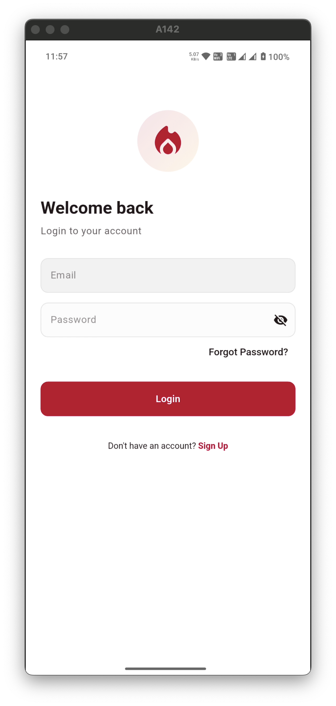
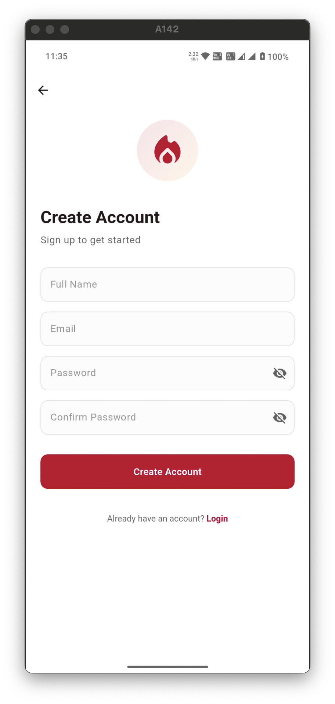
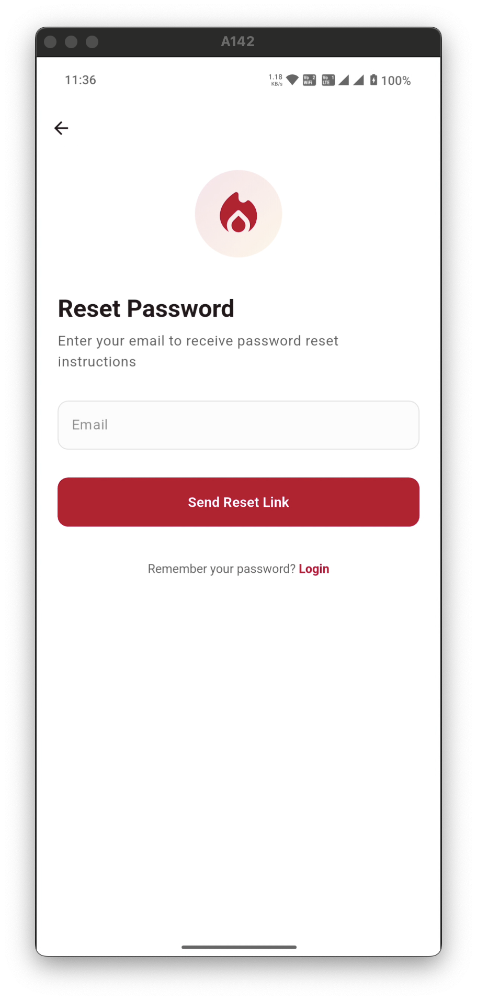
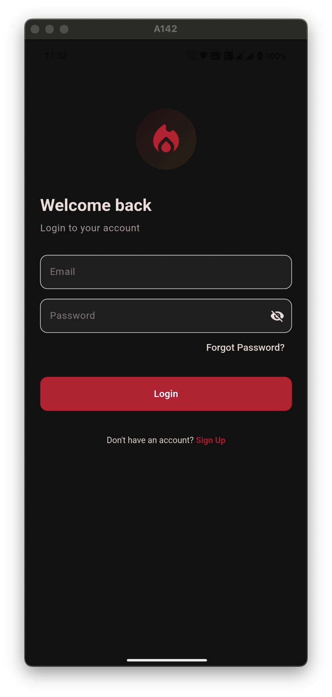
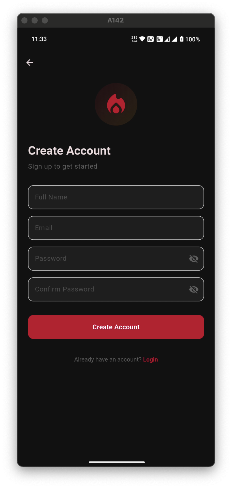
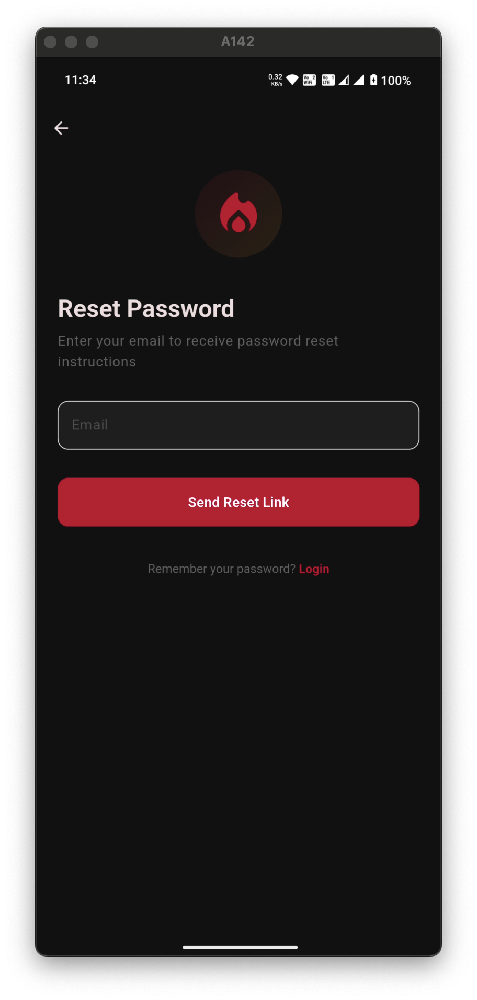

# Flutter Notification App

A modern Flutter application featuring Firebase Cloud Messaging (FCM) integration for push
notifications and a clean authentication flow.

## Features

- 🔥 Firebase Cloud Messaging Integration
- 🔒 Complete Authentication Flow
    - Login
    - Registration
    - Forgot Password
- 🎨 Material 3 Design
- 🌓 Dynamic Theme Support (Light/Dark)
- 📊 Firebase Analytics Integration

## Screenshots

### Authentication Flow

#### Light Theme
<div style="display: flex; justify-content: space-between;">
  
  
  
</div>

#### Dark Theme

<div style="display: flex; justify-content: space-between;">
  
  
  
</div>

## Technical Features

- **State Management**: Flutter Bloc
- **Dependency Injection**: GetIt
- **Navigation**: Go Router
- **Firebase Services**:
    - Cloud Messaging
    - Analytics
    - Authentication

## Architecture

The app follows Clean Architecture principles with the following layers:

- **Presentation**: Widgets, Pages, and Blocs
- **Domain**: Use Cases, Entities, and Repository Interfaces
- **Data**: Repository Implementations, Data Sources, and Models

## Getting Started

1. Clone the repository

```bash
git clone https://github.com/yourusername/flutter_notification.git
```

2. Install dependencies

```bash
flutter pub get
```

3. Configure Firebase:
    - Create a new Firebase project
    - Add your Android/iOS apps
    - Download and place the configuration files
    - Enable Authentication and Cloud Messaging

4. Run the app

```bash
flutter run
```

## Environment Setup

### Prerequisites

- Flutter SDK
- Firebase Project
- Android Studio / VS Code
- iOS Development Setup (for iOS deployment)

### Firebase Configuration

1. Add your `google-services.json` for Android
2. Add your `GoogleService-Info.plist` for iOS
3. Enable Email/Password authentication in Firebase Console
4. Configure FCM in Firebase Console

## Contributing

1. Fork the repository
2. Create your feature branch (`git checkout -b feature/AmazingFeature`)
3. Commit your changes (`git commit -m 'Add some AmazingFeature'`)
4. Push to the branch (`git push origin feature/AmazingFeature`)
5. Open a Pull Request

## License

This project is licensed under the MIT License - see the [LICENSE](LICENSE) file for details.

